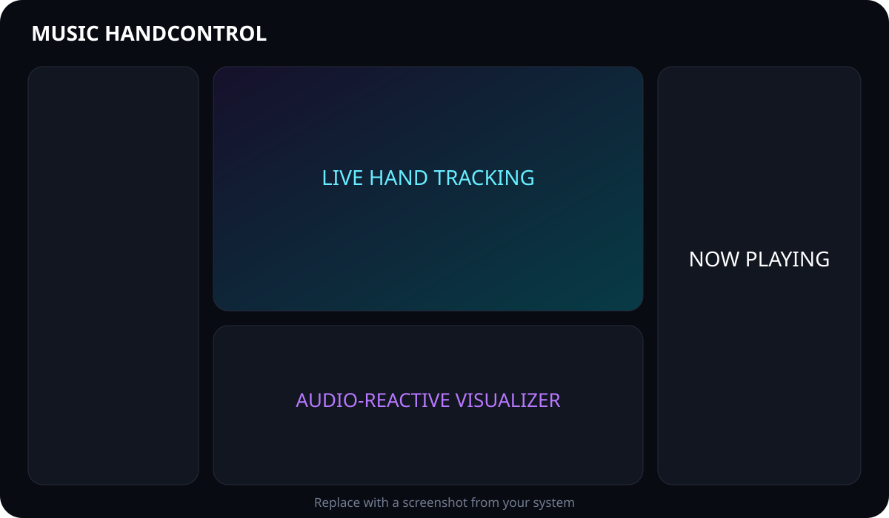

# Music HandControl

Music HandControl is a polished desktop MP3 player controlled by hand gestures, mouse, or keyboard. It combines a responsive PySide6 interface, MediaPipe hand tracking, pygame-ce playback, embedded metadata/artwork, Spotify catalog search, and three playback-synchronized visualizer modes.

> The app is local-first: it does not upload camera frames, local music, local metadata, or settings. Spotify search and YouTube import are optional online features.

## Highlights

- Open-palm hold for play/pause with state locking so a raised hand does not trigger accidentally
- Two-second right thumb–index hold for next and left thumb–index hold for previous, with visible loading progress
- Two-hand volume control: keep one hand in a peace sign and change the other hand's thumb–index distance
- Add local MP3 files or download and convert one YouTube video with an optional filename
- Separate **Local** and **Online · Spotify** library tabs
- Local-only named groups for uploaded and converted MP3 files
- Dynamic Spotify catalog search with track, artist, album, and playlist filters
- Threaded webcam capture and hand analysis, keeping the interface responsive
- Spectrum, wave, and circular visualizers with rise/fall interpolation
- MP3 metadata, duration, and embedded cover artwork via Mutagen
- Clickable playlist, seeking, mute, shuffle, repeat playlist, and repeat track
- Webcam-free operation with complete mouse and keyboard controls
- Camera, hand, sensitivity, cooldown, landmarks, and visualizer settings
- Persistent local settings and rotating diagnostic logs
- Safe handling of empty folders, missing cameras, invalid MP3s, and audio errors

## Screenshot

<!-- Replace this placeholder after capturing the app on your system. -->



## Requirements

- Windows, macOS, or Linux desktop
- Python 3.10–3.14 (64-bit recommended)
- A working audio output device
- Optional webcam for gesture control

## Install and run

```powershell
python -m venv .venv
.venv\Scripts\Activate.ps1
python -m pip install --upgrade pip
pip install -r requirements.txt
python main.py
```

On macOS/Linux, activate the environment with `source .venv/bin/activate`.

## Add music

Click **＋ Add** above the playlist and choose either:

- **From Files** — select one or more `.mp3` files. Music HandControl copies them into `music/` without overwriting an existing track.
- **From YouTube** — paste a `youtube.com` or `youtu.be` video link, optionally enter the desired MP3 filename, then select **Download and Convert to MP3**. Leave the filename blank to use the video title.

The download and FFmpeg conversion run in the background. The playlist refreshes as soon as the operation completes. Download only content you own or have permission to use; availability and permitted use vary by video and region.

You can also copy `.mp3` files directly into:

```text
music/
```

The folder is created automatically and rescanned at startup. Files are sorted by filename. MP3 files are intentionally excluded from Git; `music/.gitkeep` preserves the folder.

If the folder is empty, the app stays fully usable and displays:

```text
No music found.

Add MP3 files inside the /music folder.
```

## Local groups

The **Local** tab contains uploaded files and YouTube-converted MP3s only. Create a group with **＋**, choose it from the group menu to filter the library, then select a track and choose **Add selected to group**. Deleting a group removes only that grouping; it never deletes your MP3 files.

Groups are saved locally in the ignored `local_groups.json` file. Spotify items cannot be added to local groups.

## Spotify search

The **Online · Spotify** tab searches Spotify's catalog and opens the chosen item in Spotify. It does not stream, download, or convert Spotify audio.

1. Create a Spotify Developer Web API app and copy its Client ID.
2. In that app’s Redirect URIs, add `http://127.0.0.1` exactly (without `localhost`; Spotify permits the app to use a temporary local port).
3. Select **Connect Spotify** in Music HandControl, paste the Client ID, and approve the browser sign-in.
4. Search with at least two characters and use the filter for Tracks, Artists, Albums, or Playlists.

The Client ID is stored only in the local ignored settings file. Spotify access tokens remain in memory for the current app session and are never committed to Git. Spotify results always include an **Open selected in Spotify** action and link back to Spotify.

## Gestures

Keep the controlling hand clearly visible and roughly face the palm toward the camera. Show both hands for volume control.

| Gesture | Action | Recognition behavior |
|---|---|---|
| Open palm held for 0.85 seconds | Play / pause | Fires once; reset by changing the gesture |
| Right thumb + index held for 2 seconds | Next song | A loading bar fills from 0–100%; release early to cancel |
| Left thumb + index held for 2 seconds | Previous song | A loading bar fills from 0–100%; release early to cancel |
| Peace sign on one hand + thumb–index distance on the other | Adjust volume | Fingers together are quieter; fingers farther apart are louder |
| Release the peace sign | Keep the selected volume | Ends two-hand volume control automatically |

For Next or Previous, raise the intended hand and keep the thumb and index finger touching until the loading bar reaches 100%. Two-hand volume takes priority over track changes, so a pinch on the second hand changes volume whenever the other hand is making a peace sign.

The **Control Hand** setting applies to single-hand playback gestures. Two-hand volume always observes both hands. In Auto mode, Music HandControl uses the best-confidence hand for single-hand controls, with palm size as the tie breaker. Tune sensitivity and cooldown in Settings if lighting or camera placement causes unreliable detection.

## Gesture tutorial

Keep your full hand inside the camera view, face your palm roughly toward the camera, and wait for the gesture label before changing poses.

### Play or pause

1. Raise either hand with all fingers open.
2. Hold the open palm steady for about one second.
3. Lower or change your hand before using the gesture again.

### Next song

1. Raise your **right hand**.
2. Touch your right index fingertip and thumb together and keep them touching.
3. Watch the loading bar fill for two seconds. Releasing early cancels the action.
4. After **Next Track** appears, separate your fingers before using the gesture again.

### Previous song

1. Raise your **left hand**.
2. Touch your left index fingertip and thumb together and keep them touching.
3. Watch the loading bar fill for two seconds. Releasing early cancels the action.
4. After **Previous Track** appears, separate your fingers before using the gesture again.

### Change and keep the volume

1. Raise both hands where the camera can see them completely.
2. Make and keep a peace sign with either hand. This hand acts as the volume-mode switch.
3. On your other hand, touch the index finger and thumb together for quieter audio.
4. Move that index finger and thumb farther apart for louder audio. The displayed percentage follows their distance.
5. Release the peace sign when the volume is right. **Volume Set** appears and the selected level remains active.

For the most reliable control, use even front lighting, leave space between both hands, and avoid letting fingertips leave the frame.

## Keyboard controls

| Key | Action |
|---|---|
| Space | Play / pause |
| Right Arrow | Next track |
| Left Arrow | Previous track or restart after four seconds |
| Up Arrow | Volume +5% |
| Down Arrow | Volume −5% |

## Mouse controls

- Click any playlist item to play it.
- Drag the progress bar to seek.
- Use the player buttons for previous, play/pause, next, shuffle, repeat, and mute.
- Select Spectrum, Wave, or Circular above the visualizer.
- Turn **Hand Control** off to release the camera while music keeps playing.

## Settings

- Hand tracking: On / Off
- Camera index
- Gesture sensitivity: Low / Medium / High
- Gesture cooldown: 0.4–2.5 seconds
- Control hand: Auto / Left / Right
- Visualizer mode and sensitivity
- Hand landmark visibility

Settings are saved to the ignored `settings.json` file when the app closes.

## Technology

- **PySide6 / Qt 6** — desktop UI and painting
- **MediaPipe** — hand landmark tracking
- **OpenCV** — camera capture and frame conversion
- **pygame-ce** — streamed MP3 playback and seeking
- **NumPy** — bounded FFT spectrum analysis and animation data
- **Mutagen** — MP3 metadata and embedded artwork
- **yt-dlp** — single-video YouTube audio retrieval
- **imageio-ffmpeg** — bundled FFmpeg binary for MP3 conversion
- **Spotify Web API** — user-authorized catalog search and Spotify deep links

## Project structure

```text
handwave-music/
├── main.py
├── music/                 # add MP3 files here (not committed)
├── assets/                # MediaPipe task model when required
├── src/
│   ├── audio/             # playback, metadata, import/download, FFT analysis
│   ├── config/            # JSON settings
│   ├── library/            # local-only music group storage
│   ├── online/             # Spotify PKCE search session
│   ├── ui/                # window, camera, artwork, visualizer
│   ├── vision/            # tracking, gestures, debounce controller
│   └── utils/             # rotating logs
├── tests/
├── requirements.txt
├── ARCHITECTURE.md
├── DEPLOYMENT.md
└── SECURITY.md
```

## Troubleshooting

### Camera unavailable

Close other apps using the webcam, confirm camera permission for desktop apps, choose another camera in Settings, then toggle Hand Control off and on. The player remains functional without a camera.

### Audio device unavailable

Connect or enable an output device before launch. Check `logs/music-handcontrol.log` for backend details. Corrupt tracks are skipped or reported without terminating the app.

### Gestures fire too easily or not at all

Use even front lighting, keep the entire hand in frame, select the intended control hand, and adjust Gesture Sensitivity. Increase cooldown if discrete actions repeat too quickly.

### Visualizer is idle

The accurate spectrum is computed asynchronously after a track begins. A subtle fallback animation is displayed while analysis loads or when the decoder cannot analyze a file.

### YouTube download fails

Confirm the link points to one public YouTube video rather than a playlist, private video, live stream, or age/region-restricted video. YouTube import requires Node.js, Deno, Bun, or QuickJS; Node.js is the recommended choice. YouTube changes frequently, so update the pinned yt-dlp version after reviewing and testing upstream releases when extraction stops working. The application log contains the technical failure reason.

### MediaPipe model missing

The pinned release includes the classic Hands model. The code also supports newer Tasks-only builds; if using one and the application reports `assets/hand_landmarker.task is missing`, follow [DEPLOYMENT.md](DEPLOYMENT.md) to retrieve the official model asset.

## Development and tests

```powershell
pip install -r requirements-dev.txt
pytest
ruff check .
```

Hardware integration checks (camera, actual MP3 playback, gestures in varied lighting) must be performed on the target machine. Pure gesture interpretation, cooldowns, settings, and safe playlist discovery are covered by automated tests.

## Documentation

- [Architecture](ARCHITECTURE.md)
- [Deployment](DEPLOYMENT.md)
- [Security](SECURITY.md)

## Credits

Music HandControl was created for and is credited to **Arjunrenvon**.

## License

MIT © 2026 Arjunrenvon
